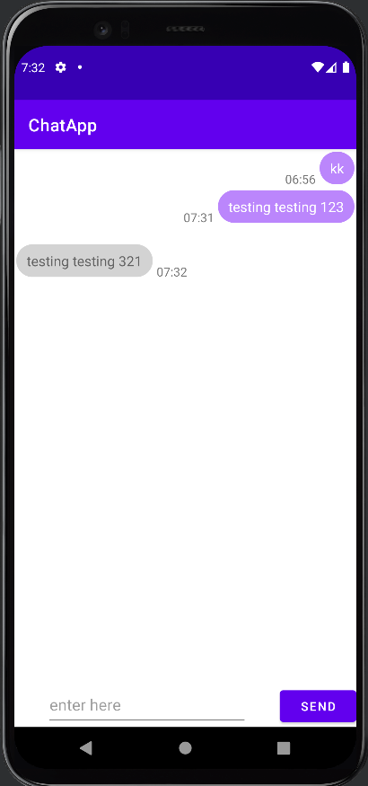

# ChatApp
A chatting app that uses the firebase realtime and cloud database.

# Currently working on:

1. Reorganize code (~)
2. All the fragment functions: (recent chat ✓, contact list ~, my profile ~)
4. Night mode
5. Regex on username and password
6. Restriction on accessing firebase

# ScreenShots
## login page

  

## register page

  

## recent chat page

  

## chat page

  

